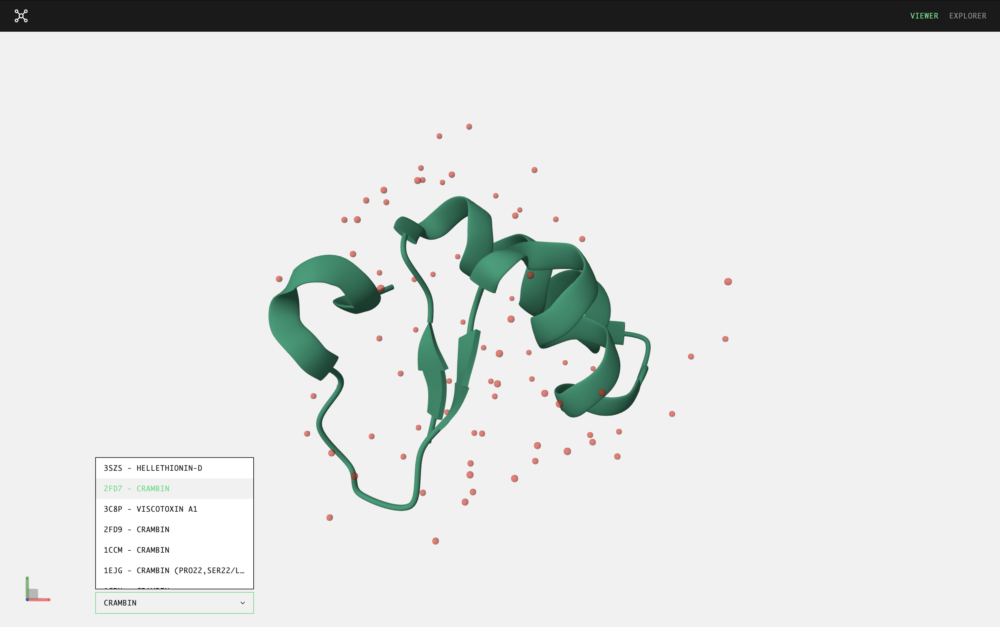
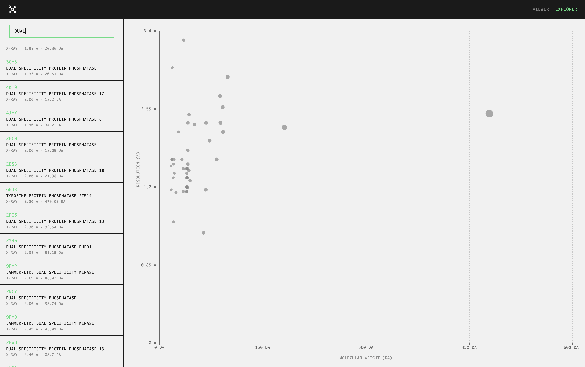

# Mol Explorer

A molecular structure visualizer built with React and [Mol\*](https://molstar.org/) for exploring proteins from the [RCSB Protein Data Bank](https://www.rcsb.org/). Search for entries by name or PDB ID and view their 3D structures interactively.





## Tech Stack

React 19, Redux Toolkit, Apollo Client, Mol\*, Floating UI, SCSS Modules, Vite (Rolldown), Vitest + MSW

## Getting Started

```bash
cp .env.example .env
bun install
bun run dev
```

The defaults in `.env.example` point to the public RCSB APIs — no configuration needed.

## Scripts

- `bun run dev` — Start dev server
- `bun run build` — Type-check and build for production
- `bun run lint` — Run ESLint
- `bun run test` — Run tests
- `bun run preview` — Preview production build
